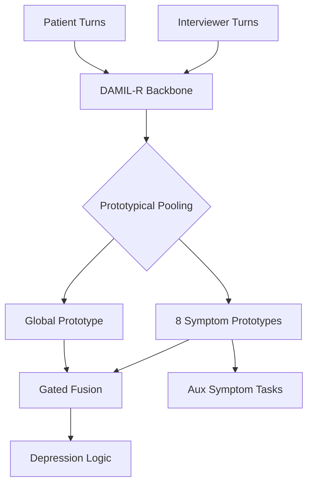

# SS-DAMIL-R: Symptom-Supervised Dual-Attention Multi-Instance Learning

This document tracks the research and development journey of **SS-DAMIL-R**, a Multi-Task Learning (MTL) extension of the DAMIL-R architecture designed to leverage auxiliary symptom supervision (PHQ-8) for improved depression detection.

## 🚀 The Breakthrough: v8.2 vs Baseline

After multiple iterations of architectural complexity, the **v8.2** configuration successfully surpassed the plain DAMIL-R baseline, capturing the synergy between symptom-level guidance and global depression detection.

| Model | ROC-AUC | F1-Score | Recall | Balanced Acc |
| :--- | :---: | :---: | :---: | :---: |
| **DAMIL-R (Baseline)** | 0.8030 | 0.5648 | 0.6924 | 0.6852 |
| **SS-DAMIL-R (v8.2)** | **0.8295** | **0.5933** | **0.7545** | **0.7041** |

> [!TIP]
> The primary victory of v8.2 lies in its **Recall (0.7545)**, which is critical for clinical screening tools where missing a positive case is more costly than a false alarm.

---

## 🏗️ Architectural Evolution & Technical Trace

The development of SS-DAMIL-R spanned three distinct architectural phases, evolving from complex instance-level prototypes to a refined shared-backbone regularization approach.

### Phase 1: Prototypical Phase (v1 - v6)
The initial hypothesis was that individual interview turns could be explicitly mapped to **Symptom Prototypes** within the latent space.



- **Mechanism**: Cosine Similarity $S_{ij} = \frac{x_j \cdot p_i}{\|x_j\|\|p_i\|}$ with a learnable scale $\tau$.
- **Constraint**: Orthogonal initialization of prototypes to ensure they span distinct symptom spaces.
- **Fail Mode**: Numerical instability (NaNs) in v3 led to the introduction of temperature scaling and `eps=1e-8` in cosine sim.

### Phase 2: Expert phase (v7)
We transitioned to a multi-head mechanism where each head acted as a "Clinical Expert" for a specific PHQ symptom.

- **Mechanism**: 9 parallel Attention Heads ($H_1 \dots H_8$ for symptoms, $H_9$ for residual).
- **Complexity**: $W_{expert} \in \mathbb{R}^{9 \times D \times 32}$. The final prediction was a weighted sum: $Z = \sum_{i=1}^8 \sigma(s_i) H_i + H_9$ where $s_i$ is the symptom prediction.
- **Fail Mode**: Signal Dispersal. The model struggled to propagate back gradients from the main task through the gated sum of experts, leading to the lowest ROC-AUC (0.74).

### Phase 3: Shared-Bottom Phase (v8 - v8.2)
We reverted to a single stable attention pooling head, using the symptom task as a **gradient anchor** rather than a structural component.

- **v8/v8.1 (Concat Head)**: Symptoms were predicted and then concatenated to the pooled representation: $X_{final} = [Pool(X); \hat{y}_{sym}]$.
- **v8.2 (Pure Aux)**: The Main Head uses *only* the pooled representation (identical to baseline). The Symptom Head shares the backbone but has no direct influence on the final logit, acting as a **pure regularizer**.

---

## 📊 Historical Technical Matrix

| Version | Architecture | Proj Dim | Dropout | Aux Weight | Threshold | Checkpoint | ROC-AUC |
| :--- | :--- | :---: | :---: | :---: | :---: | :---: | :---: |
| **v3** | Prototypical | 128 | 0.4 | 0.1 | Ordinal | F1 | 0.7529 |
| **v4** | Prototypical | 128 | 0.4 | 0.1 | Binary | F1 | 0.7752 |
| **v6** | Prototypical | 128 | 0.4 | 0.1 | Binary | F1 | -- |
| **v7** | Expert MHA| 128 | 0.4 | 0.2 | Binary | F1 | 0.7474 |
| **v8** | Concat Head | 128 | 0.4 | 0.5 | Binary | F1 | 0.7542 |
| **v8.1**| Concat Head | 64 | 0.5 | 0.8 | Binary | F1 | 0.6413 |
| **v8.2**| **Pure Aux** | **64** | **0.3** | **0.3** | **Binary**| **Val Loss** | **0.8295** |

---

## 📉 Historical Failure Mode Analysis

The "Finer Details" of the project reveal why earlier iterations underperformed compared to the baseline:

1.  **Gradient Dominance (v8.1)**: An `aux_weight` of 0.8 caused the model to optimize almost exclusively for individual symptoms. Since symptoms can be highly unbalanced, the model "gave up" on the global depression task to minimize the auxiliary loss.
2.  **Structural Rigidity (v7)**: By making the final depression prediction a gated sum of experts, the model forced a specific relationship between symptoms and depression (Additive). In reality, the relationship is more nonlinear and complex.
3.  **Optimization Noise (v3)**: Using Ordinal targets (0, 1, 2, 3) introduced high variance. The model struggled to differentiate between "low interest" (1) and "moderate interest" (2), while the binary binarization (0 vs. 1+) provided a clear clinical signal.

---

## 🧬 Finer Details for Reproduction (v8.2)

### 1. Joint objective function
$$\mathcal{L}_{total} = \mathcal{L}_{focal} + 0.3 \cdot \mathcal{L}_{symptom}$$

### 2. Implementation constants
| Constant | Value | Source File |
| :--- | :--- | :--- |
| **Focal Gamma** | 2.0 | `train_ss_damil_r.py:L34` |
| **Projector** | Linear + ReLU | `models/ss_damil_r.py:L538` |
| **Attention Hidden**| 32 | `models/ss_damil_r.py:L553` |
| **Instance Dropout**| 0.15 | `dataset.py:L287` |

---

## 🛠️ Reproduction Guide

To recreate the winning configuration (v8.2), ensure your environment has `torch >= 2.0` and `transformers >= 4.0`.

1. **Setup Data**: Place DAIC-WOZ preprocessed CSVs in `data/preprocessed/` and labels in `data/labels/`.
2. **Execute Cross-Validation**:
   ```bash
   python training/cv_ss_damil_r_v8_2.py \
       --proj_dim 64 \
       --aux_weight 0.3 \
       --dropout_rate 0.3 \
       --noise_std 0.05 \
       --checkpoint_metric val_loss
   ```
3. **Analyze Results**: Aggregated subject-level results are saved in `results/ss_damil_r_cv_v8_2/cv_report.txt`.

> [!IMPORTANT]
> The performance improvement in v8.2 relies on **Shared-Backbone Regularization**. Ensure that the `symptom_head` and `main_classifier` share the exact same `post_fusion_norm` latent representation.
